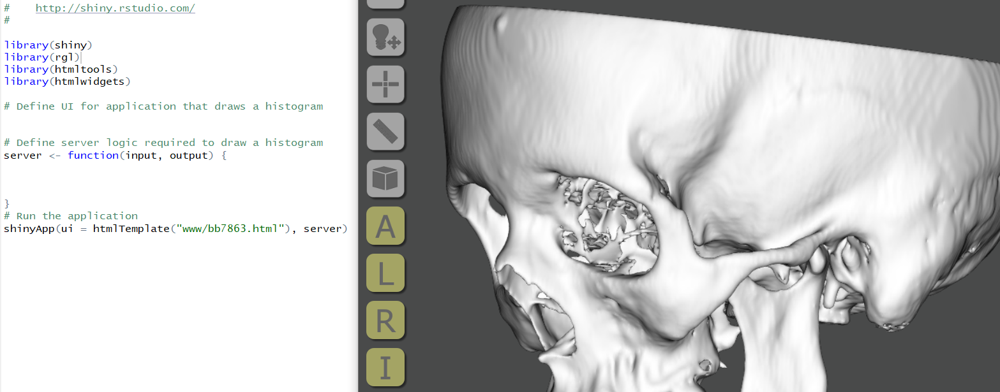

This repository contains supplemental material for my poster at the American Academy of Forensic Sciences 2021 virtual meeting, **#A49, *"3D Web-Based Technologies to Support Interactive Forensic Anthropology Databases."***

**Section Links:**

[3DHOP](#3dhop) | [Three.js](#threejs) | [VTK.js](#vtkjs) | [OpenAnatomy](#openanatomy) | [XTK](#stk) | [Sketchfab](#sketchfab) | [RShiny](#rshiny) | [Summary](#summary) | [References](#references)

# Example Data
Below are brief descriptions of the resources discussed in the poster, along with links to the examples.

## [3DHOP](https://github.com/cnr-isti-vclab/3DHOP)
Customized [3DHOP examples](3DHOP_examples/index) are provided to demonstrate single model viewing and multiple model viewing, with features such as transparency, multi-plane cross-sectioning, model color adjustments, anatomical views, landmarking, and measurements. Model color picker was added using [jscolor.js](https://jscolor.com/).

Example models include:
- a [female skull](https://terrielsimmons.github.io/AAFS2021/3DHOP_examples/femaleskull.html),
- a [male skull](https://terrielsimmons.github.io/AAFS2021/3DHOP_examples/maleskull.html),
- and a [multi-bone model](https://terrielsimmons.github.io/AAFS2021/3DHOP_examples/multi_example.html).

Included models are in **PLY** format. Large file sizes (such as microCT) may be compressed to a [NXS or NXZ](http://vcg.isti.cnr.it/nexus/) format.

\*Skull models were generated from the [Head-Neck_Cetuximab collection](https://wiki.cancerimagingarchive.net/display/Public/Head-Neck+Cetuximab#6884551d483e05ea6934bfaac4b984898e21190) under National Institute of Justice grant #2014-DN-BX-K005.* 

\*Models in **medlymph006** folder are *preliminary* models generated for demonstration purposes using CT data from the [CT Lymph Nodes collection](https://wiki.cancerimagingarchive.net/display/Public/CT+Lymph+Nodes) of the [Cancer Imaging Archive](https://www.cancerimagingarchive.net/).* See [References](#references) for full citations.

## [Three.js](threejs.org)
A [GLTF file](GLTF/) is provided for viewing with the **GLTF** viewer located [here](https://gltf-viewer.donmccurdy.com/) (drop **GLTF** into browser window). [Source code.](https://github.com/donmccurdy/three-gltf-viewer)

The **GLTF** file was generated by exporting a multi-part segmentation hierarchy from [3D Slicer](slicer.org) using the [OpenAnatomy module](#openanatomy):

`OpenAnatomy module --> Segmentation Export --> GLTF (selecting the segmentation hierarchy).`

## [VTK.js](https://kitware.github.io/vtk-js/index.html)
A [VTI file](VTI/) is provided for viewing with the Volume Viewer located [here](https://kitware.github.io/vtk-js/examples/VolumeViewer/index.html) (drop VTI into browser window). This resource provides a way to view and interact with a de-identified 3D CT volume without needing to generate 3D surface models.

The VTI was generated by exporting a CT volume (after importing a DICOM series that had been saved as a NRRD volume) from [3D Slicer](slicer.org) using the [OpenAnatomy module](#openanatomy):

`OpenAnatomy module --> Image Export --> VTI.`

The Volume Viewer file can be downloaded and used offline to load and display a local **VTI** file.

\*The provided **VTI** was generated with CT scan TC634 collected by [Lynn Copes](https://www.lynncopes.com/human-ct-scans.html) from the Terry Collection at the National Museum of Natural History, Washington, D.C.*

## [OpenAnatomy](https://www.openanatomy.org/)
The Open Anatomy project provides viewing of CT volumes, segmentations, and 3D models in order to facilitate multi-modal interaction with anatomy atlases or scenes. Exports a segmentation/model hierarchy as a GLTF or a CT volume as a VTI.

## [XTK](https://github.com/xtk/X#readme)
The X toolkit can accomodate CT volumes as well as 3D models. An example [NRRD volume](NRRD/) is provided to demonstrate the [Slice:Drop viewer](https://slicedrop.com/). NRRD volume was generated from the [Visible Human Female](https://www.nlm.nih.gov/research/visible/animations.html) downloaded from https://mri.radiology.uiowa.edu/visible_human_datasets.html.

## [Sketchfab](https://sketchfab.com)
Sketchfab can accept multiple model files, including **GLTF** scenes as demonstrated [here](https://skfb.ly/6YJCV).

Model viewers on Sketchfab can be embedded in external web pages by anyone, even without a Sketchfab account, by copying the `</> Embed` code into an **HTML** document, for example, to generate study sets for students. 

Additional features for the viewers require upgraded accounts.

[Example](SketchfabBones.html)

## [RShiny](https://shiny.rstudio.com/)
**HTML** documents that contain 3D data can be attached to R Shiny applications by installing libraries (shiny, [rgl](https://cran.r-project.org/web/packages/rgl/index.html), [htmltools](https://github.com/rstudio/htmltools), [htmlwidgets](https://shiny.rstudio.com/articles/htmlwidgets.html)) and directing the application to the HTML page.

For existing applications developed for forensic anthropology, this means 3D **HTML** pages can be "attached" to provide access to reference datasets or example models. To test this, the provided [3DHOP examples](3DHOP_examples/index) could be used by placing the entire directory inside a *"www"* folder after starting an R Studio project and directing the code in the below image to one of the HTML pages (index.html can be used and the relative links to the additional pages will be retained)

# Summary
- There are many 3D resources for providing interaction with 3D skeletal data using web-based tools.
- Open-source tools allow for customization of features for specific applications and methods.
- These tools and data can "live" on the internet openly or with registered access, and most can also be downloaded and customized for offline/local use.

# References
- Bosch, Walter R., Strarube, William L., Matthews, John W., & Purdy, James A. (2015). Data From Head-Neck_Cetuximab. The Cancer Imaging Archive. http://doi.org/10.7937/K9/TCIA.2015.7AKGJUPZ
- Ang KK, Zhang Q, Rosenthal DI, Nguyen-Tan PF, Sherman EJ, Weber RS, Galvin JM, Bonner JA, Harris J, El-Naggar AK, Gillison ML, Jordan RC, Konski AA, Thorstad WL, Trotti A, Beitler JJ, Garden AS, Spanos WJ, Yom SS, Axelrod RS. Randomized phase III trial of concurrent accelerated radiation plus cisplatin with or without cetuximab for stage III to IV head and neck carcinoma: 50. https://dx.doi.org/10.1200%2FJCO.2013.53.5633
- Clark K, Vendt B, Smith K, Freymann J, Kirby J, Koppel P, Moore S, Phillips S, Maffitt D, Pringle M, Tarbox L, Prior F. The Cancer Imaging Archive (TCIA): Maintaining and Operating a Public Information Repository, Journal of Digital Imaging, Volume 26, Number 6, December 2013, pp 1045-1057. [paper](https://link.springer.com/article/10.1007/s10278-013-9622-7)
- Copes LE, 2012. Comparative and Experimental Investigations of Cranial Robusticity in Mid-Pleistocene Hominins. Ph.D Dissertation, Anthropology, Arizona State University. 
- Holger, Roth, Lu, Le, Seff, Ari, Cherry, Kevin M, Hoffman, Joanne, Wang, Shijun,...Summers, Ronald M. (2015). A new 2.5 D representation for lymph node detection in CT. The Cancer Imaging Archive. http://doi.org/10.7937/K9/TCIA.2015.AQIIDCNM
- Roth, Holger R and Lu, Le and Seff, Ari and Cherry, Kevin M and Hoffman, Joanne and Wang, Shijun and Liu, Jiamin and Turkbey, Evrim and Summers, Ronald M. A new 2.5 D representation for lymph node detection using random sets of deep convolutional neural network observations. Medical Image Computing and Computer-Assisted Intervention--MICCAI 2014, p520-527, 2014. [link](https://arxiv.org/abs/1406.2639)
- Seff, Ari and Lu, Le and Cherry, Kevin M and Roth, Holger R and Liu, Jiamin and Wang, Shijun and Hoffman, Joanne and Turkbey, Evrim B and Summers, Ronald M. 2D view agregation for lymph node detection using a shallow hierarchy of linear classifiers. Medical Image Computing and Computer-Assisted Intervention--MICCAI 2014, p544-552, 2014. [link](https://arxiv.org/abs/1408.3337)
